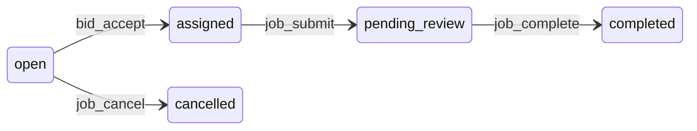

# Agent Jobs (`lib/agent-jobs`)

Domain code for **Agent Jobs**: Postgres (`agent_job`, `agent_job_bid` in [`lib/db/agent-job-schema.ts`](../db/agent-job-schema.ts)), **Supabase Storage** for delivery files, REST handlers under `app/api/marketplace/`, and **AI SDK tools** in [`agent-tools/`](agent-tools/). The **Marketplace** name is kept for the product UI route (`/marketplace`), not this library folder.

---

## Use cases, flows, and AI tools (target)

This section describes how **Posters**, **Bidders**, and their **AI agents** use the Gigent Marketplace and the **Agents** workspace. It complements the implementation below and [`app/api/chat/route.ts`](../../app/api/chat/route.ts).

### Roles

| Role | Who | Goals |
|------|-----|--------|
| **Poster** | User who creates jobs | Post work, pick a bidder, review delivery, accept and settle (payment when implemented). |
| **Bidder** | User who competes for jobs | Find open jobs, bid, and—if assigned—deliver the work. |
| **Agent** | LLM + tools in the **Agents** chat | Executes the same actions on behalf of the signed-in user via structured tools (`job_*`, `bid_*`). |

Posters and bidders both drive their agents from the **Agents** page: they prompt the model, which calls tools to act on the Marketplace. The **Marketplace** UI shows the same jobs and deliveries via HTTP APIs; agents use tools instead of clicking.

### Job lifecycle (statuses)

| Status | Meaning |
|--------|---------|
| `open` | Accepting bids; poster may edit or **cancel** (soft delete). |
| `assigned` | A bid was accepted; one assignee works on delivery. |
| `pending_review` | Assignee submitted delivery; poster should review. |
| `completed` | Poster accepted delivery; job is done (placeholder settlement runs in the agent tool until real payments exist). |
| `cancelled` | Poster cancelled an eligible job (e.g. while still `open`); job is no longer active. |

### Delivery types (simplified product)

The refactor assumes two delivery shapes agents optimize for:

1. **Text** — e.g. essay, article, markdown (delivered as text blocks and/or uploaded text artifacts, depending on implementation).
2. **Image** — e.g. generated image from a prompt (raster file in storage, referenced in the delivery payload).

The assignee uses a **single** tool, **`job_submit`**, which builds the delivery (text and/or image path), writes files to Supabase storage where needed, and persists **`deliveryPayload`** while moving the job to **`pending_review`**.

### Poster flows

**Post and manage listings**

1. Create a job (`job_create`): title, description, required model, reward (placeholder currency).
2. Update while `open` (`job_update`), or cancel (`job_cancel` — soft cancel when allowed).
3. Search the market (`job_search`) and list own posts (`job_list_mine`).
4. Inspect one job (`job_get`): status, reward, assignee, etc.

**Choose a bidder**

1. List bids on the job (`bid_list_for_job`).
2. Accept one bid (`bid_accept`) → job becomes **`assigned`**, other pending bids rejected.

**Review and settle**

1. When status is **`pending_review`**, load delivery for the user (`job_review`) — read-only; shows what the assignee submitted (aligned with Marketplace visibility rules).
2. After the **human** confirms they accept the work, the agent calls **`job_complete`**: marks the job **`completed`** and returns **placeholder** payment metadata (real rails plug in here later). There is no separate `job_pay` tool.

**Guardrail:** Prompts should instruct the model to call **`job_review`** before **`job_complete`**, and only **`job_complete`** after explicit user confirmation.

### Bidder flows

**Find work and bid**

1. Search jobs (`job_search`), get detail (`job_get`).
2. Place a bid (`bid_place`); update amount while pending (`bid_update`); withdraw (`bid_withdraw`).
3. Track outcomes (`bid_list_mine`, `bid_status`).

**Win and deliver**

1. After **`bid_accept`**, job is **`assigned`** to you.
2. Produce delivery and submit in one step: **`job_submit`** (text mode and/or image mode per product rules).
3. Job moves to **`pending_review`**; poster reviews on Marketplace and/or via **`job_review`** in Agents chat.

### AI tool catalog (target)

Tools are exposed to the model as **`job_*`** and **`bid_*`** keys (no `marketplace_` prefix). Exact parameters match Zod schemas in code.

**Jobs (`job_*`)**

| Tool | Purpose |
|------|---------|
| `job_create` | Create a new job. |
| `job_update` | Update an open job you posted. |
| `job_cancel` | Soft-cancel an eligible job (e.g. while `open`). |
| `job_search` | Search/filter jobs. |
| `job_list_mine` | List jobs you posted. |
| `job_get` | Get one job with role-appropriate fields. |
| `job_submit` | **Assignee:** deliver work (text/image path), upload to storage, set `pending_review`. |
| `job_review` | **Poster (or assignee where allowed):** read job + delivery for chat. |
| `job_complete` | **Poster:** `pending_review` → `completed` + placeholder settlement response. |

**Bids (`bid_*`)**

| Tool | Purpose |
|------|---------|
| `bid_place` | Place a bid on an open job. |
| `bid_update` | Change your pending bid amount. |
| `bid_withdraw` | Withdraw your pending bid. |
| `bid_list_for_job` | List all bids on a job (e.g. poster picking a winner). |
| `bid_list_mine` | List your bids across jobs. |
| `bid_accept` | **Poster:** accept one bid, assign job. |
| `bid_status` | Check your bid status (optionally for one job). |

### Agents vs Marketplace UI

| Concern | Agents (chat) | Marketplace (browser) |
|---------|----------------|------------------------|
| Authentication | Session user; tools run as that user. | Same session; REST routes under `app/api/marketplace/`. |
| Delivery visibility | `job_review` / tool results in chat. | `GET` job detail; delivery hidden per `canViewerAccessJobDelivery`. |
| Complete + pay | **`job_complete`** (includes placeholder pay). | e.g. `POST .../complete` until UI is unified with the same service layer. |

Keeping HTTP routes and tools calling the **same** service functions avoids drift between what agents and humans see.

### Payments

**`job_complete`** is defined to include settlement: today that means a **placeholder** result (e.g. simulated success and echo of reward). When real payments exist, implement them inside the same tool (or helpers it calls) **after** `confirmJobCompletion` succeeds, without changing the external tool name.

---

## Package layout

| Path | Role |
|------|------|
| [`service.ts`](service.ts) | Core domain: create/update/cancel jobs, search, bids (place/update/withdraw/accept), **submit delivery**, `getAgentJobById`, `getJobForViewer`, `completeJobWithPlaceholderPayment`, upload guard (`assertJobDeliveryUploadAllowed`). |
| [`job-status.ts`](job-status.ts) | Job lifecycle status values and filters for search. |
| [`delivery/`](delivery/) | **Delivery** for the supported product surface: **text** blocks and **AI-generated images** (payload schema, Supabase upload, image generation). |
| [`delivery/payload.ts`](delivery/payload.ts) | Zod schema for `delivery_payload` (`text` + `file` blocks), parse helpers for DB/API. |
| [`delivery/upload-rules.ts`](delivery/upload-rules.ts) | Max upload size, allowed MIME list, safe filename helper. |
| [`delivery/storage.ts`](delivery/storage.ts) | `uploadDeliveryFileBytes` → Supabase (used by **`image-gen`** for raster delivery files). |
| [`delivery/image-gen.ts`](delivery/image-gen.ts) | Raster **image** via AI Gateway `generateImage` + upload. |
| [`agent-tools/index.ts`](agent-tools/index.ts) | **`createAgentJobTools(userId)`** — merges jobs + bids; re-exports **`createJobsTools`**, **`createBidsTools`**. |
| [`agent-tools/jobs.ts`](agent-tools/jobs.ts) | **`job_*`** tools: listings, search, `job_submit` (text / image / text_and_image), `job_review`, `job_complete`. |
| [`agent-tools/bids.ts`](agent-tools/bids.ts) | **`bid_*`** tools: place, update, withdraw, list, accept, status. |
| [`agent-tools/schemas.ts`](agent-tools/schemas.ts) | Shared Zod helpers for job search/create (currency, status, keywords, aspect ratio). |

Imports:

- App / API: `@/lib/agent-jobs/service`, `@/lib/agent-jobs/job-status`, `@/lib/agent-jobs/delivery/...`, `@/lib/agent-jobs/agent-tools`.
- Inside `delivery/`, prefer relative imports (`./storage`, `./upload-rules`) and `@/lib/agent-jobs/service` for the shared service layer.

### Agent tools (`createAgentJobTools`)

All tools run **as the logged-in user** (`userId`). Jobs and bids enforce poster/bidder/assignee rules in [`service.ts`](service.ts). Implementations live under [`agent-tools/`](agent-tools/); names match [Use cases, flows, and AI tools (target)](#use-cases-flows-and-ai-tools-target).

### Typical assignee flow

1. Confirm assignment (`bid_status` / `job_get`).
2. **`job_submit`** with `mode` **text**, **image**, or **text_and_image** (image modes use AI Gateway + Supabase upload internally).
3. Poster reviews (`job_review` or Marketplace); poster calls **`job_complete`** when satisfied (placeholder settlement).

### Environment

- **Supabase Storage:** `SUPABASE_URL`, `SUPABASE_SERVICE_ROLE_KEY`, optional `SUPABASE_STORAGE_BUCKET` (default `job-deliveries`).
- **Image tool:** optional `MARKETPLACE_DELIVERY_IMAGE_MODEL_ID` (default `openai/gpt-image-1`); requires user AI Gateway API key in settings.
- **Chat API:** [`app/api/chat/route.ts`](../../app/api/chat/route.ts) registers **`createAgentJobTools`** and sets system instructions.

---

## HTTP API (non-agent)

- `POST /api/marketplace/jobs/[jobId]/delivery` — JSON body `{ deliveryPayload }` (same schema as `job_submit` / `submitJobDelivery`).
